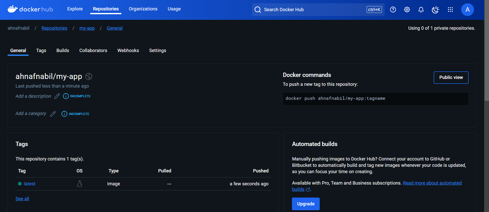

# Deploying a Node.js application with Docker and GitHub Actions

This repository contains a simple "Node.js" application that is deployed using Docker and GitHub Actions. The workflow ensures that the application is built, tested, and deployed to Docker Hub.

## Workflow

The workflow is defined in the `.github/workflows/deploy.yml` file. It consists of two jobs: `build` and `deploy`.

```bash
name: CI/CD Pipeline
on:
  push:
    branches: [main]
jobs:
  build:
    runs-on: ubuntu-latest
    steps:
      - uses: actions/checkout@v3
      - uses: actions/setup-node@v3
        with:
          node-version: '18'
          cache: 'npm'
      - run: npm ci
      - run: npm test
      - uses: docker/setup-buildx-action@v2
      - uses: docker/login-action@v2
        with:
          username: ${{ secrets.DOCKER_USERNAME }}
          password: ${{ secrets.DOCKER_PASSWORD }}
      - uses: docker/build-push-action@v4
        with:
          context: .
          push: true
          tags: ${{ secrets.DOCKER_USERNAME }}/my-app:latest

  deploy:
    runs-on: ubuntu-latest
    needs: build
    steps:
      - uses: actions/checkout@v3
      - name: Install Docker Compose
        run: |
          sudo apt-get update
          sudo apt-get install -y docker-compose
      - uses: docker/login-action@v2
        with:
          username: ${{ secrets.DOCKER_USERNAME }}
          password: ${{ secrets.DOCKER_PASSWORD }}
      - name: Pull Docker Images
        run: docker-compose pull
        env:
          DOCKER_USERNAME: ${{ secrets.DOCKER_USERNAME }}
      - name: Run Docker Compose
        run: docker-compose -f docker-compose.yml up -d
        env:
          DOCKER_USERNAME: ${{ secrets.DOCKER_USERNAME }}
```

### Build Job

The `build` job runs on the `ubuntu-latest` runner. It performs the following steps:

- Checkout the code
- Set up Node.js
- Install dependencies
- Run tests
- Build the Docker image
- Push the Docker image to Docker Hub

### Deploy Job

The `deploy` job runs on the `ubuntu-latest` runner. It performs the following steps:

- Checkout the code
- Pull the latest images
- Run the Docker Compose file




## Docker Compose File

The `docker-compose.yml` file is located in the root of the repository. It defines the services and networks for the application.

```yaml
version: '3.8'

services:
  app:
    image: ${DOCKER_USERNAME}/my-app:latest
    ports:
      - "3000:3000"
    environment:
      - NODE_ENV=production
    restart: unless-stopped
    volumes:
      - .:/app
    networks:
      - app-network

networks:
  app-network:
    driver: bridge
``` 

This file defines the `app` service, which runs the Node.js application, and the `app-network` network, which allows the services to communicate with each other.

## Required Secrets and Environment Variables

### **Secrets**
These secrets must be set in the GitHub repository under **Settings > Secrets and variables > Actions**:

1. **`DOCKER_USERNAME`**  
   - **Purpose**:  
     Used to authenticate with Docker Hub during the `docker/login-action` and as part of the image name in the `docker-compose` file.
   - **Value**:  
     Your Docker Hub username.  
     Example: `mydockerhubusername`

2. **`DOCKER_PASSWORD`**  
   - **Purpose**:  
     Used as the password/token for Docker Hub authentication.
   - **Value**:  
     Your Docker Hub password or personal access token.  
     Example: `mypassword123` or `ghp_xxx...` (token)

## Environment Variables in the Workflow
The following environment variable is explicitly passed during the `docker-compose` steps:

1. **`DOCKER_USERNAME`**  
   - **Purpose**:  
     Ensures the `docker-compose` file can reference the username dynamically for image pulling and running.  
     Example: If your `docker-compose.yml` has the following:

     ```yaml
     services:
       app:
         image: "${DOCKER_USERNAME}/my-app:latest"
     ```
     Then `DOCKER_USERNAME` will dynamically replace the placeholder during runtime.


